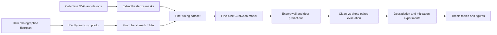

# Workflow

## Pipeline Diagram

## Script Map

| Step | Script |
|---|---|
| Rectify and crop photos | `src/data_preparation/01_build_photo_benchmark.py` |
| Prepare fine-tuning data | `src/data_preparation/02_prepare_finetuning_dataset.py` |
| Extract SVG masks | `src/data_preparation/04_extract_svg_masks.py` |
| Rasterize SVG ground truth | `src/data_preparation/05_rasterize_svg_ground_truth.py` |
| Fine-tune model | `src/training/01_finetune_cubicasa_photos.py` |
| Evaluate model | `src/evaluation/01_evaluate_finetuned_model.py` |
| Export prediction masks | `src/evaluation/02_export_prediction_masks.py` |
| Paired clean-vs-photo evaluation | `src/experiments/00_paired_clean_vs_photo_evaluation.py` |
| Baseline comparison | `src/experiments/01_compare_base_vs_finetuned.py` |
| Degradation sensitivity | `src/experiments/03_factor_ladder_sensitivity.py` |
| Mitigation test | `src/experiments/06_mitigation_test.py` |
| Generate thesis tables | `src/reporting/01_generate_thesis_tables.py` |

## Output Artifacts

The workflow produces prediction masks, paired evaluation CSV files, structural metric summaries, and figures used in the thesis report.
